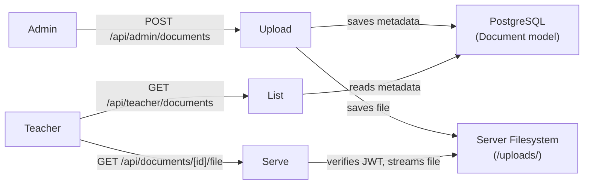

# Content Documents Feature

## Architecture Overview




Files are stored on the server filesystem in an `/uploads/documents/` directory. Access to the actual file bytes is gated behind an authenticated API route — files are never served directly from `public/`. This can be swapped to S3/Cloudflare R2 later by changing only the storage layer.

---

## 1. Database — `prisma/schema.prisma`

Add a new `Document` model:

```prisma
model Document {
  id           String   @id @default(uuid())
  nome         String
  descricao    String?
  filename     String
  mimetype     String
  size_bytes   Int
  uploaded_by  String
  criado_em    DateTime @default(now())

  @@map("documents")
}
```

Then run `prisma migrate dev --name add_documents`.

---

## 2. API Routes

- `[app/api/admin/documents/route.ts](app/api/admin/documents/route.ts)`
  - `POST` — multipart upload, saves file to `/uploads/documents/`, inserts `Document` row. Protected by `verifyAdminToken()`.
  - `GET` — lists all documents. Protected by `verifyAdminToken()`.
- `[app/api/admin/documents/[id]/route.ts](app/api/admin/documents/[id]/route.ts)`
  - `DELETE` — deletes DB row + filesystem file. Protected by `verifyAdminToken()`.
- `[app/api/teacher/documents/route.ts](app/api/teacher/documents/route.ts)`
  - `GET` — lists all published documents. Protected by `verifyTeacherToken()`.
- `[app/api/documents/[id]/file/route.ts](app/api/documents/[id]/file/route.ts)`
  - `GET` — validates admin OR teacher JWT, then streams the file with proper `Content-Disposition` headers. This is how both dashboards download files.

File upload will use the native `Request.formData()` API (built into Next.js App Router) and Node's `fs` module to write to disk.

---

## 3. Admin Content Page — `app/admin/content/page.tsx`

- Upload form: file picker + name field + optional description
- Document list table with: name, description, size, upload date, download link, delete button
- Uses `Card` and `Button` from existing `@/app/components/ui`
- Pattern matches `[app/admin/reports/page.tsx](app/admin/reports/page.tsx)`

---

## 4. Teacher Content Page — `app/teacher/content/page.tsx`

- Read-only list of documents with name, description, and a download button per item
- Download opens `GET /api/documents/[id]/file` with auth token
- Pattern matches `[app/teacher/dashboard/page.tsx](app/teacher/dashboard/page.tsx)`

---

## 5. Navigation Updates

- `[app/components/AdminNav.tsx](app/components/AdminNav.tsx)` — add `{ label: 'Conteúdo', href: '/admin/content', icon: <DocumentIcon /> }` to `baseNavItems`
- `[app/components/TeacherNav.tsx](app/components/TeacherNav.tsx)` — add `{ label: 'Conteúdo', href: '/teacher/content', icon: <DocumentIcon /> }` to `navItems`

