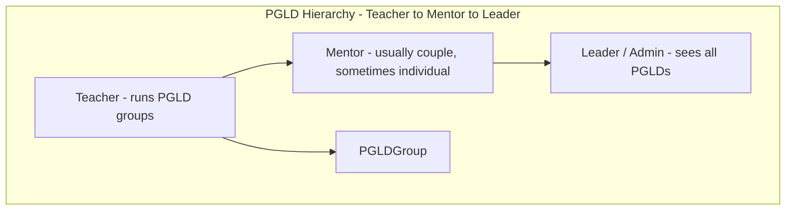
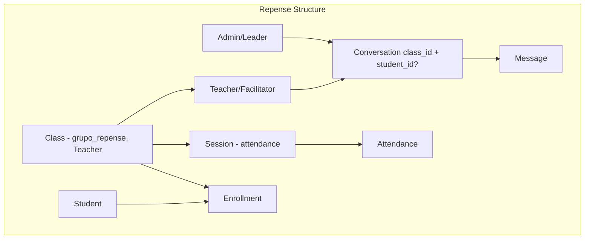

# PG Longa Duração Project - Tech Lead Task Brief

## Task Assignment

**To:** Tech Lead / Senior Developer  
**Project:** PGLD Dashboard & Portal  
**Source Reference:** repense_2026 repo (wsl.[localhost](http://localhost)\Ubuntu\root\repense_2026  
**Constraint:** New project in a separate repository. Inspect the existing PGLD database first; do not modify the current DB schema unless extremely necessary.

**Coordination:** Repense uses a shared Admin table. Superadmin (in Repense) grants access to Repense and/or PGLD dashboards. Both apps validate access on login.

---

## Objective

Build a Next.js dashboard and portal for PGLD (PG de Longa Duração) that mirrors the Repense application: teacher check-in (attendance), teacher-leader two-way communication, and full admin/teacher dashboards. The PGLD project has distinct business rules around groups (cohorts), leaders, and participants (individuals, couples, families). Use the same branding (logo, colors) as Repense.

---

## Critical First Step: Database Inspection

**Before writing any schema or application code**, you must:

1. **Inspect the existing PGLD database** (tables, relations, constraints).
2. **Document** how groups, families, couples, and users are formed.
3. **Determine the best integration approach** for the dashboard/portal against that schema.
4. **Do not modify** the current database unless it is extremely necessary. Prefer adapting the application to the existing schema.

Include an `AGENT_DATABASE_GUIDE.md` in the new repo so future agents can understand:

- The data model (groups, participants, families, couples).
- The hierarchy (Teacher → Mentor → Leader).
- Admin roles and access (repense_admin, pgld_admin, shared).

---

## PGLD Business Rules (Final)


| Rule                     | Specification                                                                                                                               |
| ------------------------ | ------------------------------------------------------------------------------------------------------------------------------------------- |
| **Group identification** | Each PGLD group must be identifiable by **1st or 2nd Semester + Teachers name** for permanent records in the DB.                            |
| **Cohort format**        | Use **"1º semestre 2025 + Teachers name"** (or "2º semestre 2025"). Shows when it started; easier for leaders to identify.                  |
| **Leaders**              | For family PGLDs: man = leader, woman = co-leader. Store leaders in the DB via **Teacher** relation (keep same relationship model).         |
| **Attendance**           | Always **individually**. Family ID is for identification only; each person is checked in separately.                                        |
| **Family age limit**     | Maximum age for kids in family PGLD: **17 years**. If anyone in the family is over 17, they do not participate in the PGLD with the family. |
| **Branding**             | Same logo, colors, and visual identity as Repense.                                                                                          |


---

## Hierarchy and Roles

### Organizational Hierarchy

```
Leader (Admin)  →  sees all PGLDs
     ↑
Mentor          →  has multiple PGLDs under them; usually couples, sometimes single individuals
     ↑
Teacher         →  runs individual PGLD groups (leader/co-leader of a group)
```

- **Teacher:** Runs one or more PGLD groups (leader/co-leader). Reports to a Mentor.
- **Mentor:** Oversees multiple PGLD groups. Mentors are usually couples, sometimes single individuals. Each mentor has a number of PGLDs under their belt.
- **Leader (Admin):** Full admin powers; sees all PGLDs across the system.

### Shared Admin Database

- **Reuse the same Admin table** as Repense (shared database or shared schema).
- Add the necessary fields/relations to support Mentors and PGLD-specific access.
- Do not duplicate the Admin table; extend it with roles and access flags.

### Admin Roles and Access (Controlled by Superadmin)

**Superadmin** grants permission to access one or both dashboards:


| Permission   | Repense Dashboard | PGLD Dashboard |
| ------------ | ----------------- | -------------- |
| Repense only | Yes               | No             |
| PGLD only    | No                | Yes            |
| Both         | Yes               | Yes            |


- **Superadmin** manages which admins can access Repense, PGLD, or both (e.g. via `can_repense`, `can_pgld` flags or `access` array).
- When an admin logs into Repense: verify `can_repense`; if denied, show error.
- When an admin logs into PGLD: verify `can_pgld`; if denied, show error.
- No dashboard access until superadmin grants it.

### Login Page (Create or Recycle)

Reuse the Repense login pattern for both apps:

- **Repense:** `app/admin/login/page.tsx` + `LoginForm` (admin login). Already exists; add access check after login (redirect to dashboard only if `can_repense`).
- **PGLD:** Copy and adapt `LoginForm` and `app/admin/login/page.tsx`. Same UI (logo, layout, branding); adapt title/subtitle for PGLD. After login, verify `can_pgld` before redirect to PGLD admin dashboard.

**Source files to recycle:**

- `app/components/LoginForm.tsx` – copy as-is; supports `role="admin"` or `role="teacher"`.
- `app/admin/login/page.tsx` – copy and adapt title ("PGLD Admin Login"), subtitle, redirectPath.
- `app/teacher/login/page.tsx` – copy and adapt for PGLD teachers.
- API `app/api/auth/admin/login/route.ts` – shared (same DB); extend to return `can_repense`, `can_pgld`; PGLD app validates `can_pgld` after login before redirect.

### Mentor Model

- **Mentor:** Entity linking to ParticipantCouple (usual case) or Participant (single individual).
- **Teacher → Mentor:** Each Teacher belongs to one Mentor.
- **Mentor → PGLDGroups:** Mentors indirectly have many PGLDs via their Teachers.
- Store Mentor in DB; extend shared Admin schema or PGLD schema as needed after inspection.




---

## Architecture Reference (Repense)




**Flows to replicate:**

- **Check-in:** Teacher opens session → creates/continues active session → marks attendance (presente, observacao) per participant → saves → finalizes with optional relatório.
- **Communication:** Conversation scoped by group + optional participant; Admin and Teacher exchange messages; both have notification dropdowns.
- **Auth:** JWT with adminId/teacherId; routes under `/admin/`* and `/teacher/`*.

---

## Data Model (Adapt to Existing DB)

If the existing PGLD DB differs, adapt the app. Target concepts:

- **Admin (shared):** Same table as Repense. Add roles/access: `repense_admin`, `pgld_admin`, or both. Used for Leaders.
- **Mentor:** Usually a couple (ParticipantCouple), sometimes single (Participant). Has many Teachers under them. One Mentor per Teacher.
- **Teacher:** Belongs to one Mentor. Runs PGLD groups (leader/co-leader). Same auth pattern as Repense teachers.
- **PGLDGroup:** Identified by cohort ("1º semestre 2025"), year/date/cycle for permanent records; leader(s) via Teacher relation; `data_inicio`, `data_fim` (1–2 years).
- **Participant:** Individuals with `nome`, `cpf`, `telefone`, `email`, etc. (plus additional info in the PGLD database).
- **ParticipantCouple:** Two participants linked. Used for couples and for Mentor couples.
- **ParticipantFamily:** Family name, primary contact; members via FamilyMember. Only members ≤17 years participate in family PGLD.
- **Enrollment:** Links group to participant OR couple OR family. Attendance is **per individual participant**.
- **Session / Attendance:** Same pattern as Repense; Attendance rows per individual.

---

## Documents and Assets to Copy from Repense

Copy these files from the **repense_2026** repo into the new PGLD project. Adapt paths and terminology (e.g. class → group, student → participant) as needed.

### Core config and styles


| Source               | Notes                                                    |
| -------------------- | -------------------------------------------------------- |
| `app/globals.css`    | Copy as-is (Poppins font, CSS variables)                 |
| `tailwind.config.ts` | Copy as-is                                               |
| `postcss.config.js`  | Copy as-is                                               |
| `next.config.js`     | Copy and adapt project name                              |
| `tsconfig.json`      | Copy as-is                                               |
| `package.json`       | Copy; remove repense-specific deps (e.g. sync, register) |
| `.eslintrc.json`     | Copy as-is                                               |
| `middleware.ts`      | Copy and adapt matcher if needed                         |


### Documentation (copy and adapt)


| Source                       | Destination            | Notes                              |
| ---------------------------- | ---------------------- | ---------------------------------- |
| `STYLE_GUIDE.md`             | `STYLE_GUIDE.md`       | Same branding; update project name |
| `DASHBOARD_SPECIFICATION.md` | Reference only         | Use to understand patterns         |
| `README.md`                  | `README.md`            | Rewrite for PGLD                   |
| `DEPLOYMENT.md`              | `DEPLOYMENT.md`        | Adapt if using similar infra       |
| `TESTING_CHECKLIST.md`       | `TESTING_CHECKLIST.md` | Adapt test cases                   |


### UI components (copy and adapt terminology)


| Source                                           | Notes                                                   |
| ------------------------------------------------ | ------------------------------------------------------- |
| `app/components/ui/Button.tsx`                   | Copy as-is                                              |
| `app/components/ui/Card.tsx`                     | Copy as-is                                              |
| `app/components/ui/Input.tsx`                    | Copy as-is                                              |
| `app/components/ui/index.ts`                     | Copy as-is                                              |
| `app/components/Modal.tsx`                       | Copy as-is                                              |
| `app/components/ToastProvider.tsx`               | Copy as-is                                              |
| `app/components/LoginForm.tsx`                   | Copy and adapt labels                                   |
| `app/components/DatePicker.tsx`                  | Copy as-is                                              |
| `app/components/Skeleton.tsx`                    | Copy as-is                                              |
| `app/components/ConversationModal.tsx`           | Adapt class→group, student→participant                  |
| `app/components/TeacherConversationModal.tsx`    | Same adaptions                                          |
| `app/components/NotificationDropdown.tsx`        | Adapt for PGLD notifications                            |
| `app/components/TeacherNotificationDropdown.tsx` | Same                                                    |
| `app/components/AdminNav.tsx`                    | Adapt nav items (classes→groups, students→participants) |
| `app/components/TeacherNav.tsx`                  | Same                                                    |
| `app/components/CreateClassModal.tsx`            | Adapt to CreatePGLDGroupModal (cohort, leader names)    |
| `app/components/EditStudentModal.tsx`            | Adapt to EditParticipantModal                           |
| `app/components/TeacherEditStudentModal.tsx`     | Adapt to TeacherEditParticipantModal                    |
| `app/components/StudentReportModal.tsx`          | Adapt to ParticipantReportModal                         |
| `app/components/TransferStudentModal.tsx`        | Adapt to TransferParticipantModal                       |
| `app/components/StudentListAccordion.tsx`        | Adapt to ParticipantListAccordion                       |
| `app/components/SessionDetailModal.tsx`          | Adapt terminology                                       |
| `app/components/CreateTeacherModal.tsx`          | Reuse for teachers/leaders                              |
| `app/components/AtRiskStudentsCard.tsx`          | Adapt or skip if not needed                             |
| `app/components/EventCard.tsx`                   | Copy if used                                            |


### Lib (copy and adapt)


| Source                   | Notes                       |
| ------------------------ | --------------------------- |
| `lib/auth.ts`            | Copy as-is                  |
| `lib/auth-types.ts`      | Copy as-is                  |
| `lib/auth-client.ts`     | Copy as-is                  |
| `lib/prisma.ts`          | Copy as-is                  |
| `lib/errors.ts`          | Copy as-is                  |
| `lib/password.ts`        | Copy as-is                  |
| `lib/hooks/useAuth.ts`   | Copy as-is                  |
| `lib/utils/cpf.ts`       | Copy as-is                  |
| `lib/utils/phone.ts`     | Copy as-is                  |
| `lib/utils/date.ts`      | Copy as-is                  |
| `lib/utils/names.ts`     | Copy as-is                  |
| `lib/date-formatters.ts` | Copy as-is                  |
| `lib/constants.ts`       | Adapt for PGLD              |
| `lib/audit.ts`           | Copy if using audit logs    |
| `lib/logger.ts`          | Copy as-is                  |
| `lib/rateLimit.ts`       | Copy if using rate limiting |


### API routes (copy and adapt)


| Source                                                 | Destination                                 | Notes                                  |
| ------------------------------------------------------ | ------------------------------------------- | -------------------------------------- |
| `app/api/auth/admin/login/route.ts`                    | `app/api/auth/admin/login/`                 | Adapt Admin→Leader if needed           |
| `app/api/auth/admin/me/route.ts`                       | `app/api/auth/admin/me/`                    | Same                                   |
| `app/api/auth/teacher/login/route.ts`                  | `app/api/auth/teacher/login/`               | Same                                   |
| `app/api/auth/teacher/me/route.ts`                     | `app/api/auth/teacher/me/`                  | Same                                   |
| `app/api/auth/teacher/change-password/route.ts`        | `app/api/auth/teacher/change-password/`     | Same                                   |
| `app/api/admin/classes/route.ts`                       | `app/api/admin/groups/route.ts`             | Adapt for PGLD groups                  |
| `app/api/admin/classes/[id]/route.ts`                  | `app/api/admin/groups/[id]/`                | Same                                   |
| `app/api/admin/classes/[id]/students/route.ts`         | `app/api/admin/groups/[id]/participants/`   | Adapt for individuals/couples/families |
| `app/api/admin/classes/[id]/conversations/route.ts`    | `app/api/admin/groups/[id]/conversations/`  | Same                                   |
| `app/api/admin/conversations/route.ts`                 | `app/api/admin/conversations/`              | Adapt                                  |
| `app/api/admin/conversations/[id]/route.ts`            | Same                                        | Same                                   |
| `app/api/admin/conversations/[id]/messages/route.ts`   | Same                                        | Same                                   |
| `app/api/admin/notifications/route.ts`                 | Same                                        | Adapt                                  |
| `app/api/admin/notifications/count/route.ts`           | Same                                        | Same                                   |
| `app/api/admin/notifications/mark-read/route.ts`       | Same                                        | Same                                   |
| `app/api/admin/teachers/route.ts`                      | Same                                        | Keep for Teacher/Leader                |
| `app/api/admin/teachers/[id]/route.ts`                 | Same                                        | Same                                   |
| `app/api/teacher/classes/route.ts`                     | `app/api/teacher/groups/route.ts`           | Adapt                                  |
| `app/api/teacher/classes/[id]/route.ts`                | `app/api/teacher/groups/[id]/`              | Same                                   |
| `app/api/teacher/classes/[id]/sessions/route.ts`       | `app/api/teacher/groups/[id]/sessions/`     | Same                                   |
| `app/api/teacher/classes/[id]/students/route.ts`       | `app/api/teacher/groups/[id]/participants/` | Same                                   |
| `app/api/teacher/sessions/route.ts`                    | Same                                        | Adapt for PGLD sessions                |
| `app/api/teacher/sessions/active/route.ts`             | Same                                        | Same                                   |
| `app/api/teacher/sessions/[id]/route.ts`               | Same                                        | Same                                   |
| `app/api/teacher/sessions/[id]/attendance/route.ts`    | Same                                        | Attendance per individual              |
| `app/api/teacher/conversations/route.ts`               | Same                                        | Adapt                                  |
| `app/api/teacher/conversations/[id]/route.ts`          | Same                                        | Same                                   |
| `app/api/teacher/conversations/[id]/messages/route.ts` | Same                                        | Same                                   |
| `app/api/teacher/notifications/route.ts`               | Same                                        | Same                                   |
| `app/api/teacher/notifications/count/route.ts`         | Same                                        | Same                                   |
| `app/api/teacher/notifications/mark-read/route.ts`     | Same                                        | Same                                   |


### Pages (copy and adapt)


| Source                                      | Destination                                   | Notes                              |
| ------------------------------------------- | --------------------------------------------- | ---------------------------------- |
| `app/layout.tsx`                            | Same                                          | Update title for PGLD              |
| `app/page.tsx`                              | Same                                          | Update landing                     |
| `app/admin/layout.tsx`                      | Same                                          | Same                               |
| `app/admin/login/page.tsx`                  | Same                                          | Recycle for PGLD; add access check |
| `app/admin/dashboard/page.tsx`              | Same                                          | Adapt stats                        |
| `app/admin/classes/page.tsx`                | `app/admin/groups/page.tsx`                   | Adapt                              |
| `app/admin/classes/[id]/page.tsx`           | `app/admin/groups/[id]/page.tsx`              | Same                               |
| `app/admin/classes/[id]/edit/page.tsx`      | `app/admin/groups/[id]/edit/page.tsx`         | Same                               |
| `app/admin/classes/[id]/students/page.tsx`  | `app/admin/groups/[id]/participants/page.tsx` | Same                               |
| `app/admin/students/page.tsx`               | `app/admin/participants/page.tsx`             | Same                               |
| `app/admin/students/[id]/page.tsx`          | `app/admin/participants/[id]/page.tsx`        | Same                               |
| `app/admin/teachers/page.tsx`               | Same                                          | Same                               |
| `app/admin/messages/page.tsx`               | Same                                          | Adapt                              |
| `app/admin/reports/page.tsx`                | Same                                          | Adapt                              |
| `app/teacher/layout.tsx`                    | Same                                          | Same                               |
| `app/teacher/login/page.tsx`                | Same                                          | Same                               |
| `app/teacher/dashboard/page.tsx`            | Same                                          | Adapt                              |
| `app/teacher/classes/page.tsx`              | `app/teacher/groups/page.tsx`                 | Same                               |
| `app/teacher/classes/[id]/page.tsx`         | `app/teacher/groups/[id]/page.tsx`            | Same                               |
| `app/teacher/classes/[id]/session/page.tsx` | `app/teacher/groups/[id]/session/page.tsx`    | Attendance per individual          |
| `app/teacher/messages/page.tsx`             | Same                                          | Same                               |
| `app/teacher/change-password/page.tsx`      | Same                                          | Same                               |


### Static assets


| Source               | Notes                      |
| -------------------- | -------------------------- |
| `public/logored.png` | Copy as-is (same branding) |


### Types


| Source                  | Notes                |
| ----------------------- | -------------------- |
| `types/client-enums.ts` | Adapt for PGLD enums |


### Full file list (copy checklist)

**Config:** `app/globals.css`, `tailwind.config.ts`, `postcss.config.js`, `next.config.js`, `tsconfig.json`, `package.json`, `.eslintrc.json`, `middleware.ts`

**Docs:** `STYLE_GUIDE.md`, `DASHBOARD_SPECIFICATION.md`, `README.md`, `DEPLOYMENT.md`, `TESTING_CHECKLIST.md`

**UI:** `app/components/ui/Button.tsx`, `Card.tsx`, `Input.tsx`, `index.ts`; `Modal.tsx`, `ToastProvider.tsx`, `LoginForm.tsx`, `DatePicker.tsx`, `Skeleton.tsx`, `ConversationModal.tsx`, `TeacherConversationModal.tsx`, `NotificationDropdown.tsx`, `TeacherNotificationDropdown.tsx`, `AdminNav.tsx`, `TeacherNav.tsx`, `CreateClassModal.tsx`, `EditStudentModal.tsx`, `TeacherEditStudentModal.tsx`, `StudentReportModal.tsx`, `TransferStudentModal.tsx`, `StudentListAccordion.tsx`, `SessionDetailModal.tsx`, `CreateTeacherModal.tsx`, `AtRiskStudentsCard.tsx`, `EventCard.tsx`

**Lib:** `lib/auth.ts`, `auth-types.ts`, `auth-client.ts`, `prisma.ts`, `errors.ts`, `password.ts`, `hooks/useAuth.ts`, `utils/cpf.ts`, `utils/phone.ts`, `utils/date.ts`, `utils/names.ts`, `date-formatters.ts`, `constants.ts`, `audit.ts`, `logger.ts`, `rateLimit.ts`

**Types:** `types/client-enums.ts`

**Assets:** `public/logored.png`

### Skip (repense-specific)

- `app/register/`* – registration flow
- `app/dashboard/`* – public dashboard
- `app/superadmin/*` – if not needed for PGLD
- `app/api/register/*`, `app/api/courses/*`, `app/api/enrollment/*`, `app/api/students/*` (public)
- `app/api/sync/*`, `app/api/dashboard/*`
- `components/AfternoonCourseWarning.tsx`, `components/FourStepsDialog.tsx`, `components/WhatsAppButton.tsx`
- `lib/enrollment.ts`, `lib/teacherStatus.ts`, `lib/notifications/whatsapp.ts`
- `lib/validations/register.ts`
- Migration SQL files (repense-specific)

---

## Implementation Phases

### Phase 1: Database inspection and project setup

- Inspect existing PGLD database; document schema in `AGENT_DATABASE_GUIDE.md`.
- Create Next.js 14 app; add Prisma, Tailwind.
- Define Prisma schema (or use existing DB connection); align with inspected schema.
- Copy `globals.css`, `tailwind.config.ts`, postcss, next.config, tsconfig.
- Run migrations only if new tables are required (avoid changing existing schema).

### Phase 2: Auth and layouts

- Port auth (JWT, verifyAdminToken, verifyTeacherToken).
- **Login pages:** Create or recycle from Repense. Copy `LoginForm`, `app/admin/login/page.tsx`, `app/teacher/login/page.tsx`. Adapt for PGLD (title, subtitle, redirectPath). Same branding.
- **Access validation:** On admin login (Repense and PGLD), verify `can_repense` / `can_pgld` from shared Admin. If denied, show error (e.g. "Você não tem permissão para acessar este painel").
- **Repense (coordinated):** Repense admin login should validate `can_repense`. Superadmin UI in Repense manages Admin access (grant Repense, PGLD, or both).
- Copy and adapt Admin layout + AdminNav.
- Copy and adapt Teacher layout + TeacherNav.

### Phase 3: Admin – groups and participants

- Extend shared Admin table with roles/access for Repense + PGLD (if not already present). Migrate only if extremely necessary.
- Add Mentor CRUD: create mentors (couple or individual); link Teachers to Mentors.
- CRUD for PGLD groups: cohort ("1º semestre 2025"), year/date/cycle, leader(s) via Teacher.
- CRUD for participants (individual, couple, family).
- Family age validation: only members ≤17 in family PGLD.
- Enrollment management: add/remove participants, couples, families to groups.
- Leader (admin) sees all PGLDs; Mentor sees only their Teachers' PGLDs (if implementing scoped views).

### Phase 4: Check-in (sessions + attendance)

- Teacher session flow: create/continue session; list all **individual** participants (flatten couples and families).
- Attendance UI: presente, observacao **per individual**.
- Finalize session with optional relatório.
- API: sessions, attendance (one row per participant).

### Phase 5: Communication

- Conversation + Message API (admin/teacher).
- Copy and adapt ConversationModal, TeacherConversationModal.
- Notification system (leader_message, etc.).
- Admin messages page, Teacher messages page.

### Phase 6: Notifications, reports, polish

- NotificationDropdown, TeacherNotificationDropdown.
- Reports/analytics.
- Audit logs if required.
- End-to-end testing.

---

## Deliverables

1. **AGENT_DATABASE_GUIDE.md** – How groups, families, couples, and users are formed; hierarchy (Teacher → Mentor → Leader); Admin roles and access; schema overview.
2. **PGLD_SPECIFICATION.md** – Full product spec (this document expanded).
3. **STYLE_GUIDE.md** – Copied and adapted from repense.
4. **DATABASE_SCHEMA.md** – Prisma schema or ER diagram (if new schema).
5. Working dashboard with check-in, communications, and reports.

---

## Reference: Repense File Map


| Purpose             | Repense path                                                           |
| ------------------- | ---------------------------------------------------------------------- |
| Schema              | `prisma/schema.prisma`                                                 |
| Auth                | `lib/auth.ts`, `lib/auth-types.ts`, `lib/auth-client.ts`               |
| Check-in UI         | `app/teacher/classes/[id]/session/page.tsx`                            |
| Conversation modals | `app/components/ConversationModal.tsx`, `TeacherConversationModal.tsx` |
| Styles              | `app/globals.css`, `tailwind.config.ts`, `STYLE_GUIDE.md`              |
| Nav                 | `app/components/AdminNav.tsx`, `TeacherNav.tsx`                        |
| API patterns        | `app/api/teacher/sessions/`, `app/api/admin/conversations/`            |


