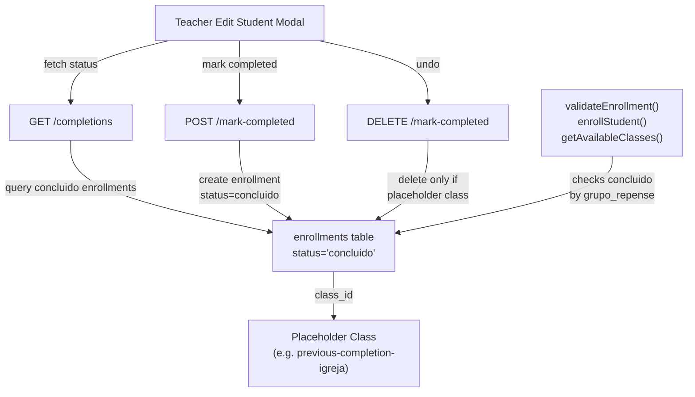

# Track Previous Repense Completions

## Approach: 3 Placeholder C placeholder classes (one per GrupoRepense). When a teacher marks a student as having prlasses + Direct Enrollment

Create 3 archivedeviously completed a repense, create an Enrollment record with `status: 'concluido'` pointing to the corresponding placeholder class. All existing validation logic already checks for completed enrollments by `grupo_repense`, so no changes needed there.

## Changes

### 1. Create 3 placeholder classes via migration

Create a SQL migration that inserts 3 Class records with fixed UUIDs:

```sql
INSERT INTO "Class" (id, grupo_repense, modelo, capacidade, numero_inscritos, eh_ativo, arquivada, status, cidade)
VALUES
  ('previous-completion-igreja', 'Igreja', 'presencial', 0, 0, false, true, 'GRUPO_ARQUIVADO', 'HISTORICO'),
  ('previous-completion-espiritualidade', 'Espiritualidade', 'presencial', 0, 0, false, true, 'GRUPO_ARQUIVADO', 'HISTORICO'),
  ('previous-completion-evangelho', 'Evangelho', 'presencial', 0, 0, false, true, 'GRUPO_ARQUIVADO', 'HISTORICO');
```

Using fixed IDs makes them easy to reference in code. `eh_ativo: false` + `arquivada: true` + `status: GRUPO_ARQUIVADO` ensures they never appear in any public or admin listing.

### 2. Constants file

Add a constants map in a shared location (e.g. [lib/constants.ts](lib/constants.ts) or similar):

```typescript
export const PREVIOUS_COMPLETION_CLASS_IDS: Record<GrupoRepense, string> = {
  Igreja: 'previous-completion-igreja',
  Espiritualidade: 'previous-completion-espiritualidade',
  Evangelho: 'previous-completion-evangelho',
};
```

### 3. New API: `POST /api/teacher/students/[id]/mark-completed`

File: `app/api/teacher/students/[id]/mark-completed/route.ts` (new)

- Accepts `{ grupo_repense: "Igreja" | "Espiritualidade" | "Evangelho" }`
- Auth: `verifyTeacherToken`, verify teacher owns/co-leads a class where student is actively enrolled (same pattern as [app/api/teacher/students/[id]/route.ts](app/api/teacher/students/[id]/route.ts))
- Check: student has no existing completed enrollment for that `grupo_repense` (query enrollments where `status = 'concluido'` and class `grupo_repense` matches)
- Create: `prisma.enrollment.create({ student_id, class_id: PREVIOUS_COMPLETION_CLASS_IDS[grupo_repense], status: 'concluido', concluido_em: new Date() })`
- No `numero_inscritos` changes needed (placeholder class capacity is irrelevant)

### 4. New API: `DELETE /api/teacher/students/[id]/mark-completed`

Same file. Accepts `{ grupo_repense }`. Deletes the enrollment record only if it points to the placeholder class (so teachers can't accidentally delete real completions). Allows undo of mistakes.

### 5. New API: `GET /api/teacher/students/[id]/completions`

File: `app/api/teacher/students/[id]/completions/route.ts` (new)

- Auth: same teacher verification
- Query all enrollments with `status = 'concluido'` for the student, join Class to get `grupo_repense`
- Return per-grupo status:
  - `"not_completed"` -- no completed enrollment
  - `"completed"` -- completed via real class (cannot undo)
  - `"completed_manual"` -- completed via placeholder class (can undo)

### 6. Update `TeacherEditStudentModal`

In [app/components/TeacherEditStudentModal.tsx](app/components/TeacherEditStudentModal.tsx):

- Add a "Repenses Concluidos" section below the existing form
- On modal open, fetch `GET /api/teacher/students/{id}/completions`
- For each of the 3 grupos, show:
  - Completed (real): green check + "Concluido"
  - Completed (manual): green check + "Concluido (manual)" + "Remover" button
  - Not completed: "Marcar como concluido" button
- Button calls POST/DELETE to mark-completed endpoint, refreshes status

### 7. Update `GET /api/students/[id]` to return `completed_courses`

In [app/api/students/[id]/route.ts](app/api/students/[id]/route.ts):

- Include completed enrollments (join Class for `grupo_repense` and `modelo`)
- This makes the continue registration page ([app/register/continue/page.tsx](app/register/continue/page.tsx)) correctly display previously completed repenses

### 8. Announcement modal component

File: `app/components/TeacherAnnouncementModal.tsx` (new)

A friendly, non-technical popup explaining the new feature. Uses `localStorage` to track how many times the teacher has seen it:

- **1st view**: Modal with explanation text + "Entendi" button (dismiss, but will show again next visit)
- **2nd+ view**: Same modal + additional "Nao mostrar novamente" checkbox/button
- **Once "Nao mostrar novamente" is selected**: never shows again for that browser

localStorage keys:

- `teacher_announcement_mark_completed_views`: number of times shown
- `teacher_announcement_mark_completed_dismissed`: boolean, permanently hidden

Content (in Portuguese, friendly tone):

- Title: "Novidade: Registro de Repenses Anteriores"
- Body explaining: some participantes ja completaram repenses em ciclos anteriores. Agora voce pode registrar isso no sistema. Ao editar um participante, voce vera uma nova secao "Repenses Concluidos" onde pode marcar quais repenses o participante ja concluiu anteriormente.
- Step-by-step: 1) Abra a lista de participantes, 2) Clique em "Editar", 3) Na secao "Repenses Concluidos", marque os que o participante ja completou
- Close button: "Entendi"

### 9. Integrate announcement into teacher layout

In [app/teacher/layout.tsx](app/teacher/layout.tsx):

- Import and render `TeacherAnnouncementModal` inside `ProtectedTeacherContent`, after the user is authenticated
- The modal handles its own show/hide logic via localStorage, so no state management needed in the layout

## What stays completely untouched

- `completeEnrollment()`, `validateEnrollment()`, `enrollStudent()`, `getAvailableClasses()` in [lib/enrollment.ts](lib/enrollment.ts)
- All admin endpoints, teacher dashboard, session/attendance flows
- Registration form, transfer logic
- The Prisma schema (no model changes, no migration beyond the data insert)

## Data flow




